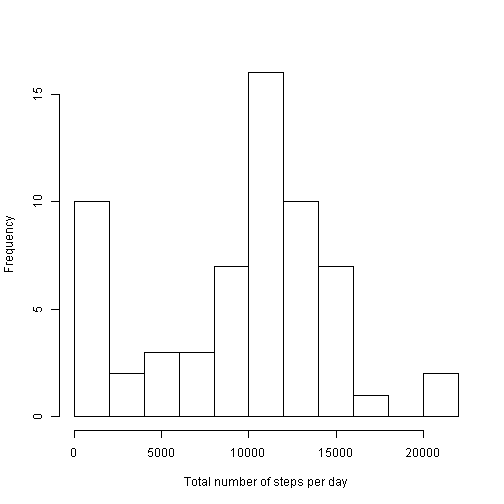
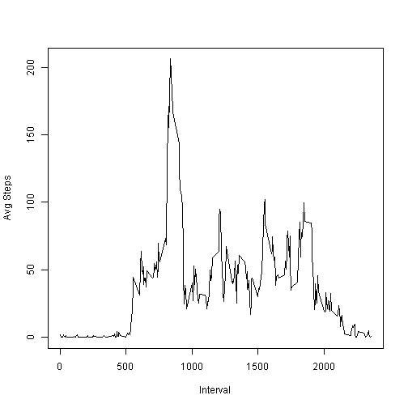
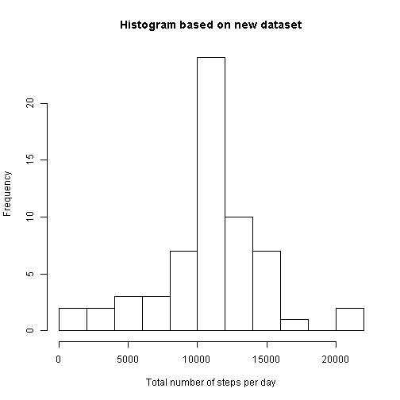
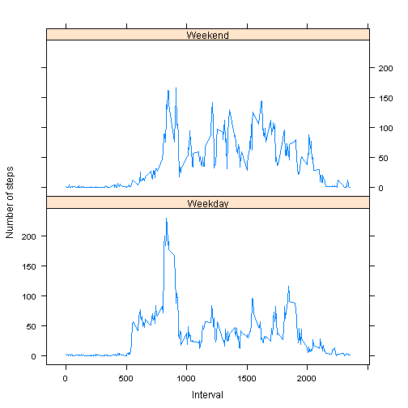

Assignment 1
====================================================

## Loading and preprocessing the data


```r
# download the activity zipfile from the web and unzip it
fileurl <- "https://d396qusza40orc.cloudfront.net/repdata%2Fdata%2Factivity.zip"
zipfile <- "activity.zip"
download.file(fileurl, destfile = zipfile, method = "curl")
unzip(zipfile)
file.remove(zipfile)
```

```
## [1] TRUE
```

```r
# read the activity file
activity <- read.csv("activity.csv", colClasses = c("integer", "Date", "integer"))
```


## What is mean total number of steps taken per day?

In order to answer this questiong, the total number of steps taken per day need to be calculated. The following is the code:


```r
library(reshape2)
meltdata <- melt(activity, id.vars = c("date", "interval"))
stepssum <- dcast(meltdata, date ~ variable, fun.aggregate = sum, na.rm = TRUE)
```


Let's look the histogram of total number of the steps taken per day.


```r
hist(stepssum$steps, xlab = "Total number of steps per day", main = "", breaks = 10)
```

 


The mean total number of steps taken per day is **9354.2295**.

The median total number of steps taken per day is **10395**.

## What is the average daily activity pattern?

In order to answer this question, the average number of steps for each interval across all the days in the dataset need to be calculated.


```r
stepmean <- dcast(meltdata, interval ~ variable, fun.aggregate = mean, na.rm = TRUE)
```


The plot of the 5-minute interval and the average number of steps taken, averaged across all days is as follows:


```r
plot(steps ~ interval, data = stepmean, xlab = "Interval", ylab = "Avg Steps", 
    type = "l")
```

 


The interval which contains the maximum number of steps is


```r
stepmean[which(stepmean$steps == max(stepmean$steps)), 1]
```

```
## [1] 835
```

## Imputing missing values

The total number of missing values in the dataset is


```r
indx <- is.na(activity$steps)
sum(indx)
```

```
## [1] 2304
```


Now, we'll create a new dataset *newdata*, which is all the same with the original dataset but the missing values is replaced with the mean for that 5-minute interval. The R codes are as follows:


```r
newdata <- activity
missing <- newdata$interval[indx]
filled <- numeric()
for (id in 1:nrow(stepmean)) {
    filled[missing %in% stepmean$interval[id]] <- stepmean$steps[id]
}
newdata$steps[indx] <- filled
```


In order to compare the new dataset with the original dataset, let's look the histogram of the total number of steps taken each day based on the new dataset.


```r
newmelt <- melt(newdata, id.var = c("date", "interval"))
newstepsum <- dcast(newmelt, date ~ variable, fun.aggregate = sum)
hist(newstepsum$steps, xlab = "Total number of steps per day", main = "Histogram based on new dataset", 
    breaks = 10)
```

 


The mean total number of steps taken per day in the new dataset is **1.0766 &times; 10<sup>4</sup>**.

The median total number of steps taken per day in the new dataset is **1.0766 &times; 10<sup>4</sup>**.

As we can see, the mean and median total number of steps taken per day are both greater than that in the original dataset.

## Are there differences in activity patterns between weekdays and weekends?

First, we need to create a new variable indicating whether a given date is a weekday or weekend day.


```r
# set aspects of the locale to return the weekday names in english
Sys.setlocale("LC_TIME", "English United States")
```

```
## [1] "English_United States.1252"
```

```r
day <- weekdays(newdata$date)
newdata$days <- ifelse(day %in% c("Saturday", "Sunday"), "Weekend", "Weekday")
```


The panel plot of the 5-minute interval and the average number of steps taken, averaged across all weekday days or weekend days is as follows:

```r
library(lattice)
newmeltmean <- melt(newdata, measure.vars = "steps")
newstepmean <- dcast(newmeltmean, days + interval ~ variable, fun.aggregate = mean)
xyplot(steps ~ interval | days, data = newstepmean, xlab = "Interval", ylab = "Number of steps", 
    type = "l", layout = c(1, 2))
```

 

